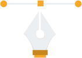
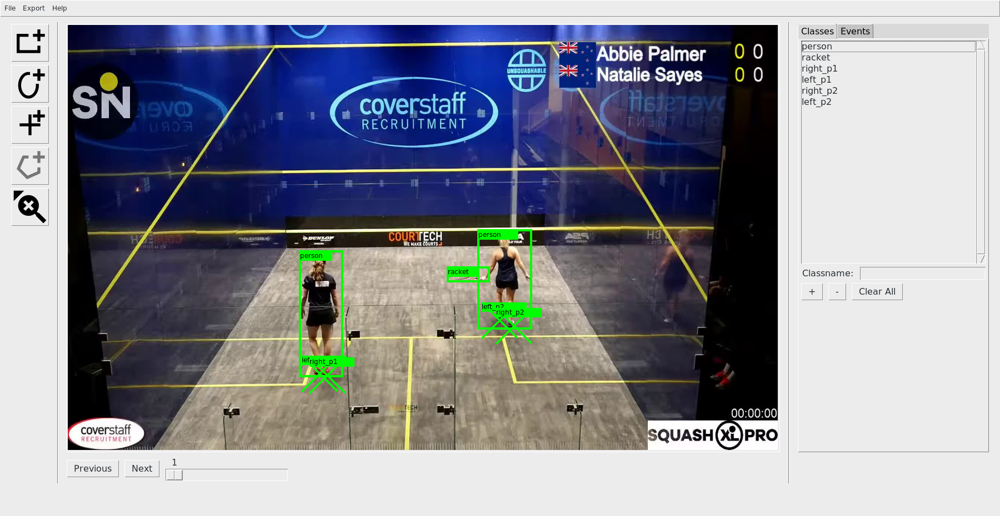
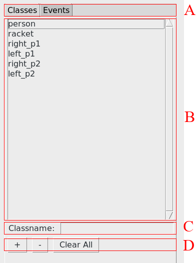
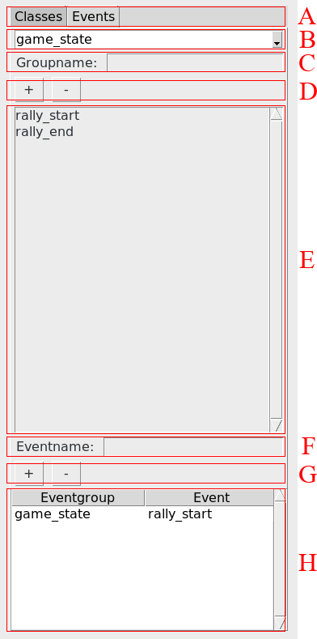

## Object instance and event annotation tool 

*PANN* (**P**ython **ANN**otator for **ANN**s) is a **cross-platform python annotation tool based on OpenCV and PySimpleGui**. It provides an environment
for marking objects and events in videos on a frame-by-frame basis.

## Features:

* **Object instance** labeling using different shapes (point, rectangle, circle)
* Organizing events in **event groups**
* Labeling **events** for frames
* Stepping through **image frames**
* Outputs separate (JSON) files for object and event labels
* *Experimental: Export for YoloV4*

###### P**ANN**otator screenshot

## Getting started
### Setup (Linux)

1. Create virtual environment

    `python3 -m venv /path/to/new/virtual/environment`

1. Activate the environment

    `source /path/to/new/virtual/environment/bin/activate`

1. Install requirements from `requirements.txt`

    `pip install -r requirements.txt`

1. Create a new project directory

    `mkdir -p projects/new_project`

1. Start the application with your project folder

    `python3 main.py --project_folder=./projects/new_project>`

### Project structure

A project will contain several json files. The main project definition is specified
by `projectPaths.json` which contains absolute paths for all other files and folders:

| Entry             | Content                                                 |
|:------------------|:--------------------------------------------------------|
| data_path         | Folder containing the images used for labeling.         |
| class_list_path   | List of classes available for object instance labeling. |
| class_labels_path | Actual class labels for the data.                       |
| event_list_path   | List of event groups and events for labeling.           |
| event_labels_path | Actual event labels.                                    |

### Quick start guide:
#### A) Quick start: Managing the class list

* Select *Classes* shown in (A).
* Type your class name in (C) and hit the **+** button in (D).
* Your class name now appears in (B) and you can use it for object instance labeling.
* To remove a class from (B), simply select the class and hit **-** in (D).
* Clear All removes all classes from the list.

#### B) Quick start: Managing the event (groups) list

* Select *Events* shown in (A).
* Create an EventGroup by typing its name in (C) and hit the **+** button in (D).
* All of your EventGroups are available in (B) (e.g. game_state).
* To add a new event to your selected eventgroup in (B), insert the event's name in (F) and hit the **+** button in (G). the event appears in (E) (e.g. rally_start or rally_end)
* To remove an event from a group, select it in (E) and hit the **-** buttion in (G).
* To remove an entire eventgroup, select it in (B) and hit the **-** button in (D).

#### C) Quick start: Object instance labeling

1. Select the class from your class list.
1. Select your tool of choice (A black box will indicate your selection).
1. Drag (rectangle, circle) or click (point). A new annotation will appear in red.
1. Hitting enter will confirm your label and it will turn green. 
1. Select an other frame by using the navigation bar at the bottom or your left and right keys.
1. The selected tool and class will retained.

| Tool | Purpose |
|---:|:---|
|     | Creates a **rectangle shape** label. |
|        | Create a **circle shape** label. |
|          | Creates a **point shape** label.|
|    | **Removes** the selected label. |
| | |
|       | Planned feature. **Not implemented yet!** |

#### D) Quick start: Event group labeling
1. Open the frame where the event occurs.
1. Select the corresponding eventgroup in (B) and double click on the event in (E). The eventgroup and event now appears in (H) for the visible frame only.
1. To remove an event from a frame, double click on the entry in (H). It will disappear.

### Citation
Please cite in your publications if it helps your research:
    
    TBA: BibTeX Entry  

TBA: [link to paper]()

### License
This program is free software: you can redistribute it and/or modify
it under the terms of the GNU General Public License as published by
the Free Software Foundation, either version 3 of the License, or
(at your option) any later version.

This program is distributed in the hope that it will be useful,
but WITHOUT ANY WARRANTY; without even the implied warranty of
MERCHANTABILITY or FITNESS FOR A PARTICULAR PURPOSE.  See the
GNU General Public License for more details.

You should have received a copy of the GNU General Public License
along with this program.  If not, see <https://www.gnu.org/licenses/>.